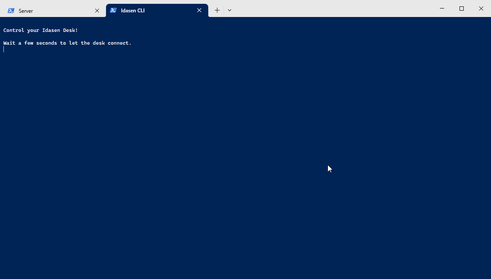

## IDASEN CLI

Control your IKEA [Idasen](https://www.ikea.com/us/en/p/idasen-desk-sit-stand-black-dark-gray-s79280998/) standing desk from a minimal CLI. This project is built around [idasen-controller](https://github.com/rhyst/idasen-controller) by [rhyst](https://github.com/rhyst).

## REQUIREMENTS

- [Python 3](https://www.python.org/downloads/)
- [Windows Terminal](https://github.com/microsoft/terminal) with a PowerShell 5 profile
- A Bluetooth LE analyser like [Bluetooth LE Lab](https://apps.microsoft.com/store/detail/bluetooth-le-lab/9N6JD37GWZC8) (note this is only needed once to find your desk's MAC address)

## INSTALL

- Download the [latest release](https://github.com/gliptal/idasen-cli/releases/latest).
- Unzip the package.
- Create a Python virtual environment in `idasen-cli`'s directory:

    `python -m venv .venv`

## CONFIGURE

- Pair your PC to your desk via Bluetooth.

- Configure for Windows Terminal:

    `idasen-cli` as provided assumes you have a Windows Terminal profile named "PowerShell 5"; if you don't have one, modify the [run.bat](run.bat) script by replacing the "PowerShell 5" occurences with the name of your PowerShell 5 profile:

    `WT -d . -p "<ps5-profile>" server.bat ; nt -d . -p "<ps5-profile>" client.bat`

- Configure [config.bat](config.bat):

    | OPTION        | DESCRIPTION                                                                                                                   |
    |---------------|-------------------------------------------------------------------------------------------------------------------------------|
    | `mac_address` | your desk's MAC address: this should never have to be changed once set                                                        |
    | `favourites`  | your desk height settings (see [idasen-controller's configuration](https://github.com/rhyst/idasen-controller#configuration)) |

## USAGE

- Run `idasen-cli.bat` or the `Idasen CLI` shortcut.

    A new Windows Terminal instance will open with two tabs: the left tab is the `idasen-controller` server that keeps a connection open with your desk; the right tab is the minimal `idasen-cli`.

- Interact with the CLI.

    Specify a preset either by name (like "sit" or "stand") or id. Type `status` or `0` to get the current desk height.

    

## ACKNOWLEDGMENTS

- [idasen-controller](https://github.com/rhyst/idasen-controller) by [rhyst](https://github.com/rhyst), that actually communicates with the desk.
- [Tabler Icons](https://tablericons.com/) for this project's icon.
